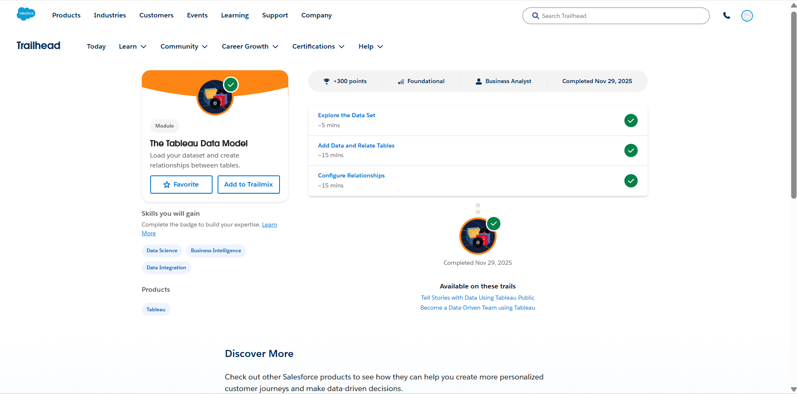
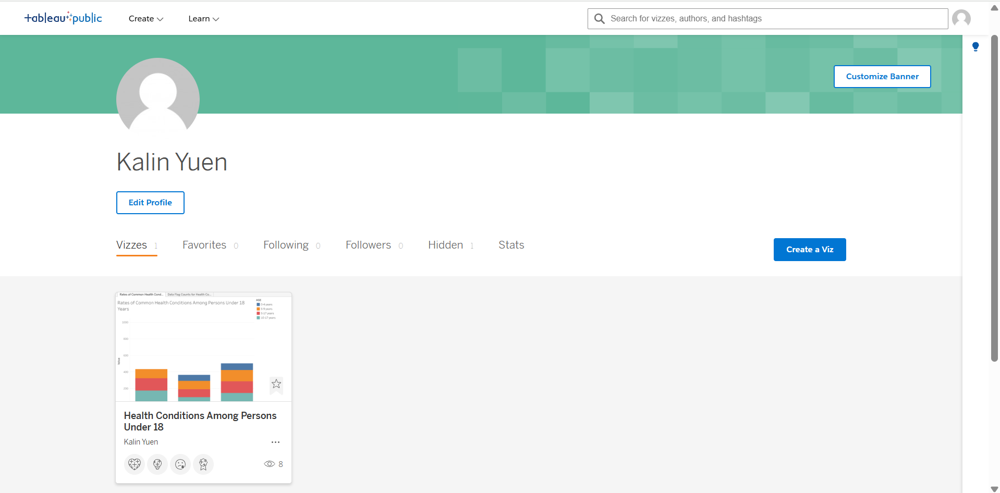
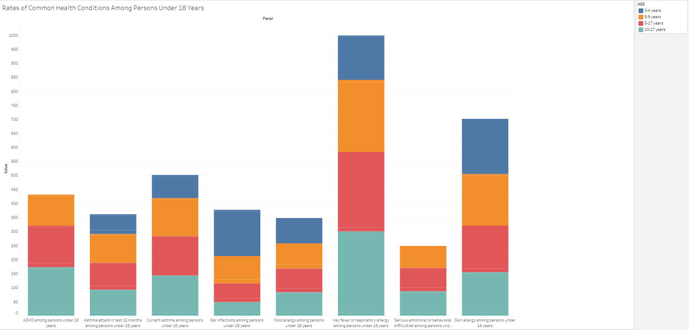
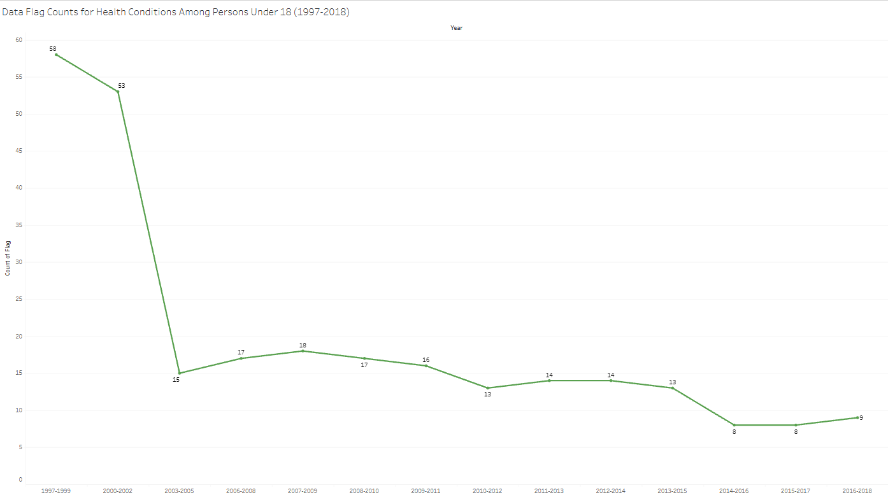

# Tableau Trailhead Modules & Tableau Public Viz
## Trailhead Evidence
Module 1

Module 2

Tableau Public Viz

Sheet 1

Sheet 2

Tableau Public Viz URL: https://public.tableau.com/app/profile/kalin.yuen/viz/HealthConditionsAmongPersonsUnder18/RatesofCommonHealthConditionsAmongChildrenUnder18Years

## Reflection
One key thing I learned from Data Storytelling with Tableau Public was the importance of keeping visuals simple and focused on a single, clear message, which guided me to design charts that highlight only the key trends in children’s health conditions without unnecessary clutter. From The Tableau Data Model, the concept of relationships stood out because it allows multiple tables to stay separate while still being analyzed together, preventing duplicated data and maintaining accuracy. This matters in real-world datasets where information is often spread across many sources, especially in healthcare. For example, tracking pediatric asthma trends would require linking separate tables for patient demographics, clinical visits, and diagnosis codes. Tableau would be great for this scenario because its relationship-based modeling and visual storytelling tools make it easy to uncover patterns and communicate insights clearly.
